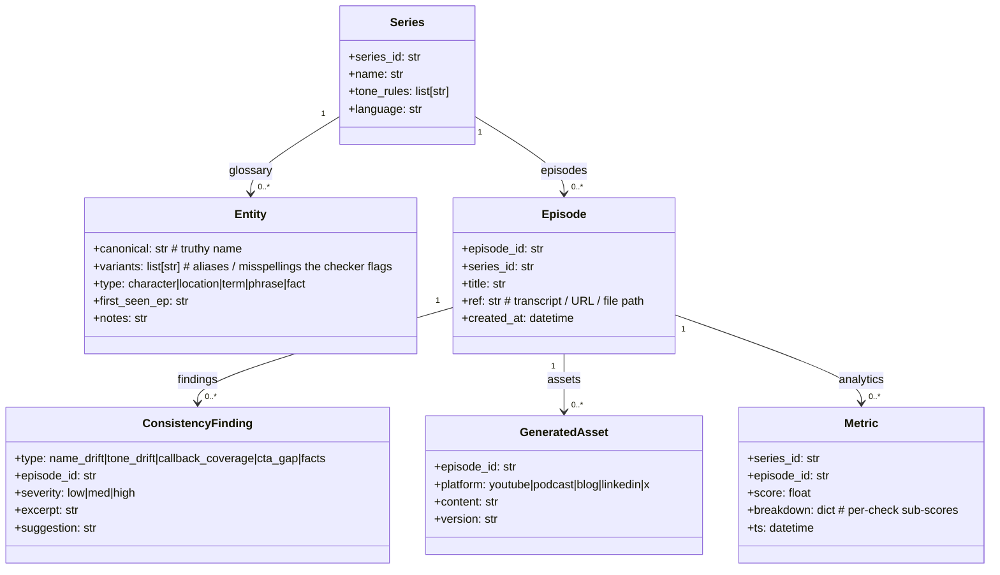

# Architecture & Technical Flow

> The "Creator Series Consistency Studio" = one reusable consistency engine, wrapped
> differently for each hackathon. Build the engine first, layer integrations on top.

## 1. High-level architecture

```
                         ┌──────────────────────────────────────────┐
                         │            SHARED CORE  (Python)           │
                         │  glossary  ·  checker  ·  generators      │
                         │  evals     ·  store(abc)  ·  test-cases   │
                         └──────────────────┬─────────────────────────┘
                                            │ import (Python)
            ┌──────────────┬───────────────┼─────────────────┬───────────────┐
            │   Layer 1    │   Layer 2     │   Layer 3       │   Layer 4     │
            │  WebMCP      │  All Things   │  Agentic Cinema │  micro1 sprint│
            │  (Sep 3)     │  (Aug 31)     │  (Sep 9)        │  (Aug 31)     │
            └──────────────┴───────────────┴─────────────────┴───────────────┘
```

**Core principles**
1. The core engine has **no dependency on any agent framework**. It exposes plain
   Python functions (`load_series`, `check_consistency`, `generate_notes`,
   `update_glossary`) and a `Store` protocol (`LocalStorageStore`, `FirestoreStore`,
   `ClickhouseAnalyticsStore`).
2. Each hackathon layer is a **thin wrapper** that mounts the engine behind that
   hackathon's required tech (WebMCP `document.modelContext`, Google ADK + GCP,
   or a coding-agent sprint with a locked env).
3. Evaluation artifacts (baseline vs agent, consistency score, trajectory diffs)
   are generated identically so the "improvement story" transfers across submissions.

## 2. Data model



- **Entity.variants**: collected by the checker + corrected by the generator/human.
  Matching is fuzzy (`rapidfuzz.token_set_ratio`) with a threshold tuned per type.
- **Metric**: the schema persisted to ClickHouse in Layer 3 (Cinema) for analytics.
- **Store protocol**: `class Store(Protocol)` with `get_series / save_series /
  list_episodes / save_finding / save_metric` — implemented by local JSON
  (Layer 1 / micro1), Firestore (Layer 2), ClickHouse (Layer 3).

## 3. Core engine — internal flow

```
1. load_series(series) ──► Store.put(Series, entities, episodes)
   │  parse transcript → chunk by speaker / topic boundary (sliding window)
   │  extract candidate entities via NER (gemini via vertex, or open local model)
   │  dedupe against existing glossary (fuzzy match variants)
   │
2. check_consistency(series_id, checks) ──► [ConsistencyFinding]
   ├── name_drift      : each entity.variants occurrence vs canonical name
   ├── tone_drift      : per-episode embedding centroid vs series tone_rules
   ├── callback_coverage: planned callbacks vs mentions; flags missed callbacks
   ├── cta_gap         : episode-level CTA presence (regex + LLM verify)
   ├── facts           : cross-episode claim contradiction (agentic self-check)
   └── persist Metric(score, breakdown) to Store
   │
3. generate_notes(episode_id, platform, cta) ──► GeneratedAsset
   │  pull episode chunk + glossary context + consistency findings
   │  render via platform template (YouTube desc, podcast show notes, blog)
   │
4. evals/run_eval(series_id, hard_cases) ──► Report
   ├── baseline: one-shot generation WITHOUT memory
   ├── agent:    check → correct → generate WITH memory
   ├── compare:  consistency score, token cost, hard-case pass rate
   └── write changelog.md + trajectories/
```

The checker uses a **two-tier verification** (mirrors micro1's rubric):
- **Deterministic tier** (rules + fuzzy match) — fast, reproducible, tested.
- **LLM tier** (Gemini 3.5) for claim contradiction + tone drift — called only when the
  deterministic check is ambiguous. All LLM calls are logged for trajectory dumps.

## 4. Layer 1 — WebMCP Challenge flow (Sep 3)

```
Browser (Chrome 149+ / ChatGPT)                       Backend (optional)
┌──────────────────────────────────────┐   ┌─────────────────────────────┐
│ React + Vite SPA                     │   │ FastAPI on Cloud Run/Vercel │
│                                      │   │                             │
│  <App/> loads SeriesStudio lib       │   │  /api/consistency            │
│  (Pyodide-compiled core)             │   │  /api/generate               │
│                                      │   │                             │
│  document.modelContext.registerTool( │   │  (only if Pyodide too slow)  │
│    load_series   / check_consistency │◀──│◀── proxy for heavy ops      │
│    generate_notes / update_glossary  │   │                             │
│  )                                   │   │                             │
│                                      │   │                             │
│  Human edits glossary in live UI ◀──►│   │                             │
│  Agent calls tools via MCP client   ◀──►│                             │
└──────────────────────────────────────┘   └─────────────────────────────┘
```

**Runtime contract:**
- On page load: `SeriesStudio.init()` registers all 4 tools + a `get_series_state`
  resource (`modelContext.registerResource`) so the agent can read current glossary.
- `load_series`: human uploads a CSV/transcripts → core ingests → UI updates live.
- `check_consistency`: tool runs the core checker → returns a JSON report that the
  UI renders as a checklist of findings (agent + human can both act on it).
- `update_glossary`: agent proposes an entity correction → UI shows a **confirmation
  dialog** (the spec supports `requestUserConfirmation`); human accepts/denies.
- All state is mirrored to `localStorage` so a judge revisiting the URL sees the
  same series (reproducible demo).

**Origin isolation:** set `Origin-Agent-Cluster: ?1` header (Vercel `vercel.json`
headers, or `_headers` on Cloudflare Pages) so `document.modelContext` is enabled.

## 5. Layer 2 — All Things Agentic flow (Aug 31, Collaborative Partner track)

```
Human creator            Cloud Run (Gemini+ADK)         Firestore                  Pub/Sub
   │                         │                            │                          │
   │ "check continuity for │                            │                          │
   │  my series S1"          │                            │                          │
   ├────────────────────────► LlmAgent (Gemini 3.5)       │                          │
   │                         │ tools: load_series,        │                          │
   │                         │   check_consistency,       │                          │
   │                         │   generate_notes,          │                          │
   │                         │   update_glossary          │                          │
   │                         │ memory: FirestoreMemory    ◄──────────────────────────┤
   │                         │    (series canon persists) │                          │
   │                         │  ┌────────────────────────┐                          │
   │                         │  │ loop: plan→act→verify   │                          │
   │                         │  │ ask clarifying Qs       │                          │
   │                         │  │ propose glossary edits   │                          │
   │                         │  │ await human confirmation │◀─────────────────────────┤
   │                         │  └────────────────────────┘                          │
   │ ◄────────────────────────  report findings + suggestions                        │
   │                         │                            │                          │
   │                         │ (async)  Pub/Sub trigger fires on  │                  │
   │                         │            new episode in Cloud Storage              │
   │                         │  ──► Cloud Run worker ──► check_consistency          │
   │                         │                            │──► save Metric         │
   │                         │                            │──► update Firestore    │
```

**Why Collaborative Partner (not Taskmaster):**
The core value is a **stateful, multi-turn, memory-backed conversation** where the agent
asks "Did you really mean 'Jon' or 'John' in ep 3?" and remembers the canonical name
next episode. That is the Collaborative Partner definition verbatim ("asks clarifying
questions, guides the user, captures feedback, adapts").

- **Gemini:** `gemini-3.5-flash-002` via Vertex AI (`google-cloud-aiplatform`).
  Accepted package + required "Gemini 3.5 or newer" rule verified.
- **Framework:** Google ADK Python. `LlmAgent` with the 4 core functions as
  `@tool`-decorated functions wrapping the core engine.
- **Memory:** ADK `FirestoreMemory` (or a custom `Memory` backed by Firestore) keyed by
  `series_id` — survives across sessions (the "long-term memory" the track rewards).
- **Async/Taskmaster alternative:** wire the Pub/Sub→Cloud Run path as the event-driven
  "Taskmaster" story (new episode → agent auto-runs checks → emails findings). You can
  submit the same repo under either track by changing the framing in the README/video.

**Submission proof-of-GCP:** deploy on Cloud Run, screenshot the Cloud Run service detail
page + a Firestore document in the demo video. Cost: Cloud Run always-free + Firestore
free tier + $150 credits.

## 6. Layer 3 — Agentic Cinema flow (Sep 9, ClickHouse partner track)

Same ADK agent as Layer 2, plus a **runtime ClickHouse integration** via
`mcp-clickhouse` + ADK `MCPToolset`. Frame: "Series Continuity & Show-Notes Agent for
independent creators."

```
Human creator        Cloud Run (Gemini+ADK)        Firestore (state)   ClickHouse (analytics)
   │                    │                             │                    │
   │ "run continuity     │                             │                    │
   │  analytics for S1"  │                             │                    │
   ├──► LlmAgent         │                             │                    │
   │                    │  tools: core engine functions                     │
   │                    │   + MCPToolset(mcp-clickhouse)                    │
   │                    │     → sql_query, sql_insert, sql_describe        │◄─►
   │                    │   memory: FirestoreMemory (canon)                  │
   │                    │  ┌────────────────────────────────────────┐      │
   │                    │  │ plan: check_consistency(series)         │      │
   │                    │  │        → agent calls CHECK →             │      │
   │                    │  │        → agent calls SQL_INSERT metrics   │      │
   │                    │  │        → agent calls SQL_QUERY for drift  │      │
   │                    │  │          "compare ep 5 vs ep 12 tone"     │      │
   │                    │  │        → generate_notes(platform=youtube)   │      │
   │                    │  └────────────────────────────────────────┘      │
   │ ◄──── report +    │                             │                    │
   │  metrics table    │                             │                    │
```

**How the partner is "used at runtime in code" (passes Cinema review):**
- `mcp-clickhouse` is launched as a real stdio subprocess (not README mention).
- ADK `MCPToolset` imports its `sql_query` / `sql_insert` tools into the agent.
- The agent's loop **calls** these tools to:
  1. `INSERT INTO continuity_metrics (...)` after each `check_consistency` run.
  2. `SELECT` trend queries ("episodes where name_drift > 0.5") to explain findings.
- Demo video shows the agent's trace (ADK `InMemoryTrace`) making ClickHouse tool calls
  + a Grafana dashboard reading from the same ClickHouse cluster.

**ClickHouse setup:** free $400 credits via `promo=SIGNUP100`; or prototype against the
public playground (`sql-clickhouse.clickhouse.com`, `demo` user). `mcp-clickhouse` env:
`CLICKHOUSE_HOST`, `CLICKHOUSE_USER`, `CLICKHOUSE_SECURE=true`, transport `stdio` for
local / `http` with token for Cloud Run.

**Optional Grafana layer:** ADK's OpenLIT instrumentation → Grafana AI Observability
MCP tools read agent traces. This is the "observe the agent you build" bonus.

## 7. Layer 4 — micro1 sprint (Aug 31) — applied to the core

When the kickoff problem is known:
- Scaffold a fresh repo with `uv init`, lock deps, `Dockerfile` (one-command: `docker
  build -t studio . && docker run ...`).
- The core engine is the **candidate base**: if the problem is creator/continuity
  tooling, reuse `core/` directly; if not, use `core/` patterns (pure-Python, typed,
  tested, reproducible) to build the sprint solution.
- Capture agent **trajectories** (`trajectories/`) — coding-agent turns, edits, test runs.
- Run `pytest` (hard-case tests) + `ruff` + `mypy`; emit a `changelog.md` (baseline →
  final → evidence) and `REPRODUCTION.md` (exact clone+run steps).

If the micro1 problem is **unrelated** to series consistency, do NOT force-fit the studio:
build a focused 3-day solution but apply the same discipline (locked env, trajectory
dump, edge-case tests, ambiguity log). Document that explicitly in the write-up — micro1
explicitly rewards "stating what you deliberately did not do, and why" as engineering
judgment.

## 8. Sample ADK agent (Layer 2/3 skeleton)

```python
# agents/continuity_agent.py
import trace
from google.adk.agents import LlmAgent
from google.adk.tools import FunctionTool, MCPToolset
from core.engine import load_series, check_consistency, generate_notes, update_glossary
from core.firestore_store import FirestoreMemory

# Core functions become agent tools (no framework coupling inside core)
_tools = [
    FunctionTool(load_series),
    FunctionTool(check_consistency),
    FunctionTool(generate_notes),
    FunctionTool(update_glossary),
]

# Layer 3 ONLY: add ClickHouse partner at runtime
try:
    _tools.append(MCPToolset(
        connection_params={"transport": "stdio", "command": "mcp-clickhouse"}
    ))
except Exception:
    pass  # Layer 2 doesn't require it

agent = LlmAgent(
    model="gemini-3.5-flash-002",
    name="series_continuity_agent",
    instruction=(
        "You are a continuity guardian for a creator's series. "
        "You maintain a living glossary and verify cross-episode consistency. "
        "Before suggesting a glossary change, ask the human to confirm. "
        "Always explain your reasoning and cite which episode a claim was found in."
    ),
    tools=_tools,
    memory=FirestoreMemory(collection="studio_memory"),
)

root_agent = agent
```

**Entry points:**
- `main.py` → `adk_agents.run(agent, session_service=FirestoreSessionService)` (web/Layer 2).
- `worker/main.py` → Pub/Sub-triggered Cloud Run job calling `check_consistency`
  (Layer 2 async; Layer 3 can reuse).
- `streamlit_app.py` or `cmd/` for quick local demo.
